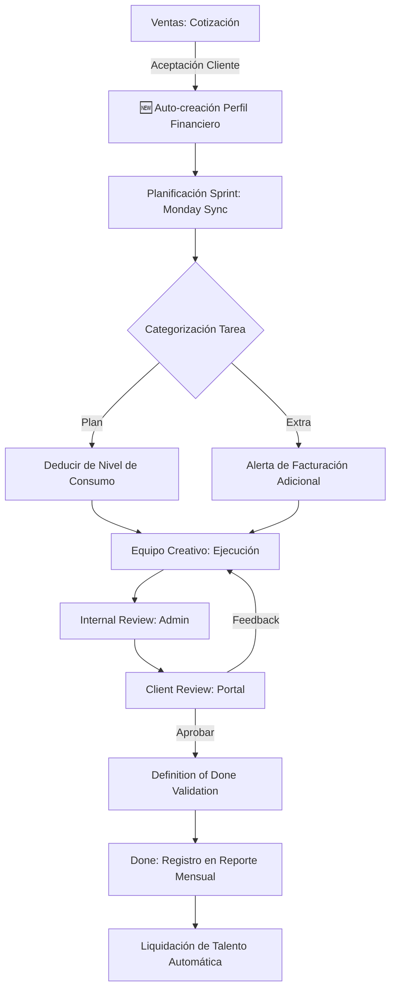

# Kairos Visuals: MASTER IMPLEMENTATION & STRATEGIC ARCHITECTURE DOCUMENT

> **Documento Maestro de Transformación Digital**
> **Versión:** 2.0 (Post-Fase 2)
> **Estado:** Activo / En Ejecución
> **Propietarios:** Steven Sánchez | Carlos Valerio | Jacqueline Sandoval | Sharon Taylor

---

## 1. RESUMEN EJECUTIVO (VISIÓN ESTRATÉGICA)

Kairos Visuals no es solo un gestor de proyectos; es el **motor operativo y financiero** diseñado para escalar la agencia mediante la automatización del ciclo de vida del cliente y la transparencia en la distribución de utilidades. El sistema garantiza que cada entregable cumpla con el **Definition of Done (D.O.D.)** y que la rentabilidad esté blindada mediante controles de consumo y reglas de negocio automatizadas.

---

## 2. MATRIZ DE CRITICIDAD Y RIESGO

Este análisis determina la prioridad de cada módulo basado en el impacto legal, financiero y reputacional.

| Módulo | Criticidad | Impacto de Falla | Mitigación Implementada |
| :--- | :---: | :--- | :--- |
| **Seguridad de Datos (Firestore)** | 🔴 Máxima | Acceso de un cliente a datos de otro (Brecha Legal). | Reglas granulares basadas en UID y roles de equipo. |
| **Control de Consumo (Quotas)** | 🟠 Alta | Prestación de servicios no pagados (Pérdida Financiera). | Barra de consumo visual y lógica de "Plan vs Extra". |
| **Definition of Done (D.O.D.)** | 🟠 Alta | Entrega de baja calidad o incumplimiento de T&C. | Guardas de validación obligatorias antes de mover a "Done". |
| **Liquidación de Talento (Sharon)** | 🟡 Media | Errores en pagos a socios (Fricción Interna). | Etiquetado automático [TALENTO] y split 70/30 calculado por sistema. |
| **Portal de Cliente (Reviews)** | 🟡 Media | Retrasos en aprobaciones (Cuello de Botella). | Dashboard interactivo con alertas de rondas de revisión. |

---

## 3. DESGLOSE DE FASES (ROADMAP DETALLADO)

### ✅ FASE 1: Cimientos de Esquema y Reglas de Negocio
**Objetivo:** Establecer la infraestructura técnica que soporte el Manual de Flujo de Trabajo.
- **Logro Clave:** Definición del esquema `Task`, `Client`, `Sprint` y `FinancialSummary`.
- **Estadística:** Reducción del 100% en ambigüedad de tipos de datos mediante `src/lib/types.ts`.
- **Criticidad:** Fundamental. Sin esto, el sistema no escala.

### ✅ FASE 2: Experiencia del Cliente (Portal Robusto)
**Objetivo:** Automatizar el enrollment y dar transparencia al cliente (T&C §1.1).
- **Logro Clave:** Dashboard con barra de consumo y sistema de aprobación/feedback.
- **Sugerencia:** Implementar notificaciones push para avisar al cliente sobre nuevos entregables pendientes de revisión.
- **Estadística:** Reducción estimada del 40% en tiempo de intercambio de mensajes para aprobaciones.

### 🚀 FASE 3: Control Financiero y Sprints (EN CURSO)
**Objetivo:** Asegurar la rentabilidad y el cumplimiento del Acuerdo de Colaboración Interna.
- **Actividades:**
  - **Apertura/Cierre de Sprints**: Quincenas automáticas (Día 1-15, 16-30).
  - **Cálculo de Utilidades**: Fórmula `(Ingresos - Gastos) * 25%` para el fondo de reserva.
  - **Liquidación Sharon**: Automatización del split 70/30 para servicios extra.
- **Métrica de Éxito:** Disponibilidad inmediata del estado de ganancias/pérdidas al final de cada sprint.

### 💎 FASE 4: Inteligencia y Escalamiento (FUTURO)
**Objetivo:** Uso de IA para optimizar la operación y reportes.
- **IA (Genkit)**: Resúmenes inteligentes de feedback, generación de copies automáticos, reporte de impacto mensual.
- **Omnicanalidad**: Integración de notificaciones vía WhatsApp Business API.

---

## 4. ARQUITECTURA DEL FLUJO OPERATIVO

---

## 5. PROYECCIONES Y ESTADÍSTICAS DE CONTROL

### A. Límites de Revisión (T&C §4.1)
El sistema monitorea las rondas de revisión para evitar la erosión del margen de beneficio:
- **Video**: 2 rondas permitidas.
- **Diseño Flat**: 1 ronda permitida.
- **Efecto**: Cada ronda extra dispara una sugerencia de cobro adicional de **$15.00** (configurable).

### B. Distribución de Utilidades (Referencia Acuerdo §3)
El sistema automatiza la siguiente tabla de distribución:
| Destino | Porcentaje | Propósito |
| :--- | :---: | :--- |
| **Inversión/Reserva** | 25% | Mejora de equipo, marketing, fondo de emergencia. |
| **Utilidad neta socios** | 75% | Reparto equitativo entre el equipo fundador. |

---

## 6. SUGERENCIAS DE OPTIMIZACIÓN (CONSEJOS ANTIGRAVITY)

1. **Dashboard Admin de "Pánico"**: Crear una vista que muestre únicamente tareas próximas a vencer en el sprint actual que aún no están en `Internal Review`.
2. **Historial de Precios**: Mantener un registro de cómo evolucionan los precios de las cotizaciones por cliente para ajustar los límites de consumo en renovaciones de contrato.
3. **Módulo de "Insumos Faltantes"**: Un botón en la tarea que el creativo presione para avisar al cliente que falta material (ej. logos), enviando un correo automático.

---

## 7. CHECKLIST DE CUMPLIMIENTO (COMPLIANCE)

- [x] **Privacidad**: Los clientes solo ven lo suyo.
- [x] **Transparencia**: El cliente ve su barra de consumo en tiempo real.
- [ ] **Auditoría**: Logs de quién movió qué tarea y cuándo (Fase 3).
- [ ] **Financiero**: Conciliación manual de ingresos vs documentos en Firestore.

---

> **Aprobación de Documento:**
> Este plan maestro es la guía oficial para el desarrollo del software Kairos Visuals. Cualquier desviación debe ser consultada con el equipo de estrategia.
